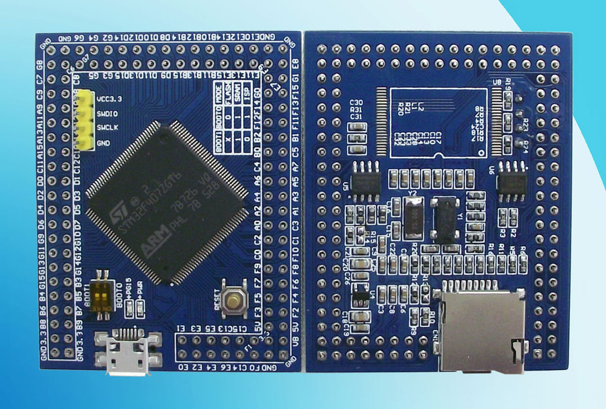

# VCC GND STM32F407ZGT6 Mini

MicroPython board definition files for the STM32F407ZGT6 Mini board from [VCC-GND](http://vcc-gnd.taobao.com).



You can buy one for around $30 AUD (Oct 2019) on [AliExpress].

### Build the firmware

Clone the board definitions to your [MicroPython](https://github.com/micropython/micropython) `ports/stm32/boards` folder.

```bash
cd micropython/ports/stm32/boards
git clone https://github.com/mcauser/VCC_GND_F407ZG.git

cd ..
make BOARD=VCC_GND_F407ZG
```

### Flashing via DFU

This board can be flashed using DFU. To put the board in DFU mode, disconnect
USB, slide the BOOT0 DIP switch to the ON position (towards USB) and reconnect USB.

Now you can flash the board using USB with the command:

```bash
make BOARD=VCC_GND_F407ZG deploy
```

Once the upload is complete, disconnect USB, slide BOOT0 back
to the original position and reconnect USB.

Alternatively, you can use the MicroPython command `pyb.bootloader()`
to get into DFU mode without needing to use the switch.

Currently, you need to unplug and replug the board in order to switch from DFU
mode back to regular mode.

### Accessing the board

Once built and deployed, you can access the MicroPython REPL (the Python prompt) via USB serial.

```bash
screen /dev/tty.usbmodem1422 115200
# or
screen /dev/ttyACM0 115200
```

### Specifications

* STM32F407ZGT6 ARM Cortex M4
* 168MHz, 210 DMIPS / 1.25 DMIPS / MHz
* 1.8V - 3.6V operating voltage
* 25MHz system crystal (NX5032GA)
* 32.768KHz RTC crystal
* AT24C08 I2C EEPROM 1024 Byte x 8, 400KHz
* W25X40BVSNIG SPI Flash 4Mbit (512x8bit), 104 MHz
* 2.54mm pitch pins
* JTAG/SWD header
* 1 MByte Flash, 192 + 4 KByte SRAM
* 3x SPI, 3x USART, 2x UART, 2x I2S, 3x I2C
* 1x FSMC, 1x SDIO, 2x CAN
* 1x USB 2.0 FS / HS controller (with dedicated DMA)
* 1x USB HS ULPI (for external USB HS PHY)
* Micro SD
* 1x 10/100 Ethernet MAC
* 1x 8 to 12-bit Parallel Camera interface
* 3x ADC (12-bit / 16-channel)
* 2x DAC (12-bit)
* 12x general timers, 2x advanced timers
* RT9193-3.3V: 3.3V LDO voltage regulator, max current 300mA
* Micro USB for power and comms
* User LED (PG15)
* 2x DIP switch for bootloader selection
* Reset button
* 2x22 side pins + 2x6 top pins + 2x13 bottom pins, 1x4 J-Link pins
* Dimensions: 59.69mm x 46.99mm

### Modifications

This board has a 25MHz system crystal oscillator.

* change HSE_VALUE from 8000000 to 25000000
* change PLL_M from 8 to 25

### Exposed Port Pins

* PA0-PA15
* PB0-PB15
* PC0-PC15
* PD0-PD15
* PE0-PE15
* PF0-PF15
* PG0-PG15

### Peripherals

# SPI Flash W25X40 (U5)

* 1 PC4 CS
* 2 PA6 D0
* 3 3V3 WP
* 4 GND
* 5 PA7 DIO
* 6 PA5 CLK
* 7 3V3 HOLD
* 8 3V3 VCC

# NandFlash K9F5608 (U8)

* 6 GND
* 7 PG6 R/B#
* 8 PD4 RE#
* 9 PG10 NAND_CS CE#
* 12 3V3 VCC
* 13 GND VSS
* 16 PD11 CLE
* 17 PD12 ALE
* 18 PD5 WE#
* 19 3V3 WP#
* 29 PD14 I/O0
* 30 PD15 I/O1
* 31 PD0 I/O2
* 32 PD1 I/O3
* 36 GND VSS
* 37 3V3 VCC
* 41 PE7 I/O4
* 42 PE8 I/O5
* 43 PE9 I/O6
* 44 PE10 I/O7

#### AT24C08 8K EEPROM (U6)

* 1 GND PRE
* 2 GND NC
* 3 GND E
* 4 GND
* 5 PB7 SDA
* 6 PB6 SCL
* 7 GND MODE
* 8 3V3 VCC

#### SWD debug (P4)

* 1 GND
* 2 PA14 SWCLK
* 3 PA13 SWDIO
* 4 3V3 VCC

#### USB (U3)

* 1 VCC 5V
* 2 PA11 USB_DM
* 3 PA12 USB_DP
* 4 GND ID
* 5 GND

#### Micro SD

* 1 PC10 SDIO_D2
* 2 PC11 SDIO_D3
* 3 PD2 SDIO_CMD
* 4 3V3
* 5 PC12 SDIO_SCK
* 6 GND
* 7 PC8 SDIO_D0
* 8 PC9 SDIO_D1
* 9 GND
* 10 PF10 SW1

#### User LED

* PG15 LED0

### Links

* [STM32F407ZG on st.com](https://www.st.com/en/microcontrollers-microprocessors/stm32f407zg.html)
* Buy on [AliExpress] or search for "STM32F407ZGT6 Mini"
* Buy on [Taobao](https://item.taobao.com/item.htm?id=523383164199)
* [STM32F407 datasheet](docs/STM32F407_datasheet.pdf)
* [STM32F407ZGT6 mini schematics](docs/STM32F407ZGT6_schematics.pdf)
* [STM32F407ZGT6 mini PCB](docs/STM32F407ZGT6_mini.pdf)
* [STM32F4 alternate function mapping](docs/STM32F4-AF-mapping.pdf)

### Related boards

* [MCUDev Black STM32F407VET6](https://github.com/mcauser/BLACK_F407VE)
* [MCUDev Black STM32F407ZET6](https://github.com/mcauser/BLACK_F407ZE)
* [MCUDev Black STM32F407ZGT6](https://github.com/mcauser/BLACK_F407ZG)
* [MCUDev DevEBox STM32F407VET6](https://github.com/mcauser/MCUDEV_DEVEBOX_F407VET6)
* [MCUDev DevEBox STM32F407VGT6](https://github.com/mcauser/MCUDEV_DEVEBOX_F407VGT6)
* [VCC GND STM32F407VET6 Mini](https://github.com/mcauser/VCC_GND_F407VE)
* [VCC GND STM32F407ZGT6 Mini](https://github.com/mcauser/VCC_GND_F407ZG) - this board

[AliExpress]: https://www.aliexpress.com/item/32819158767.html

## License

Licensed under the [MIT License](http://opensource.org/licenses/MIT).
